## Recording Your Findings  

## Recording the Anus, Rectum, and Prostate Examination  

"No perirectal lesions or fissures. External sphincter tone intact. Rectal vault without masses. Prostate smooth and nontender with palpable median sulcus. (Or in a female, uterine cervix nontender.) Stool brown and Hemoccult negative."  

## OR  

"Perirectal area inflamed; no ulcerations, warts, or discharge. Cannot examine external sphincter, rectal vault, or prostate because of spasm of external sphincter and marked inflammation and tenderness of anal canal." (These findings suggest proctitis from infectious cause.)  

## OR  

"No perirectal lesions or fissures. External sphincter tone intact. Rectal vault without masses. Left lateral prostate lobe with \(1 \times 1\) cm firm hard nodule; right lateral lobe smooth; medial sulcus is obscured. Stool brown and Hemoccult negative." (These findings are suspicious for prostate cancer.)

---

## Aids to Interpretation  

## Table 15-1 BPH Symptom Score Index: American Urological Association (AUA)  

Score or ask the patient to score each of the questions below on a scale of 1 to 5, with \(0 = \text{not at all}\) , \(1 = \text{less than 1 time in 5}\) , \(2 = \text{less than half the time}\) , \(3 = \text{about half the time}\) , \(4 = \text{more than half the time}\) , and \(5 = \text{almost always}\) .  

Higher scores (maximum 35) indicate more severe symptoms; scores \(\leq 7\) are considered mild and generally do not warrant treatment.  

## PART A  

## Score  

1. Incomplete emptying: Over the past month, how often have you had a sensation of not emptying your bladder completely after you finished urinating?  

2. Frequency: Over the past month, how often have you had to urinate again \(< 2\) hours after you finished urinating?  

3. Intermittency: Over the past month, how often have you stopped and started again several times when you urinated?  

4. Urgency: Over the past month, how often have you found it difficult to postpone urination?  

5. Weak stream: Over the past month, how often have you had a weak urinary stream?  

6. Straining: Over the past month, how often have you had to push or strain to begin urination?  

## PART A TOTAL SCORE  

For Part B, \(0 = \text{none}\) , \(1 = 1\) time, \(2 = 2\) times, \(3 = 3\) times, \(4 = 4\) times, \(5 = 5\) times.  

## PART B  

## Score  

7. Nocturia: Over the past month, how many times did you most typically get up to urinate from the time you went to bed at night until the time you got up in the morning? (Score 0 to 5 times on night)  

TOTAL PARTS A and B (maximum 35)

---

## Table 15-2 Abnormalities on Rectal Examination  

## External Hemorrhoids  

(Thrombosed). Dilated hemorrhoidal veins that originate below the pectinate line, covered with skin; a tender, swollen, bluish ovoid mass is visible at the anal margin.  

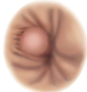
  

Anal Fissure. Painful longitudinal oval ulceration usually in posterior midline with swollen sentinel tag just below it.  

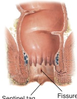
  

## Anorectal Fistula. An  

Inflammatory tract or tube opening inside the anus or rectum and also onto the perianal area or into another viscus.  

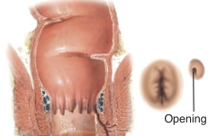

Fistula 
  

Polyps of the Rectum. A soft mass that may or may not be on a stalk; may not be palpable.  

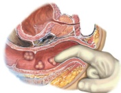

(table continues on page 292) 

---

## Table 15-2 Abnormalities on Rectal Examination (continued)  

## Benign Prostatic Hyperplasia.  

An enlarged, nontender, smooth, firm but slightly elastic prostate gland; can cause symptoms without palpable enlargement.  

## Acute Prostatitis. A prostate  

that is very tender, swollen, and firm because of acute infection.  

## Cancer of the Prostate. A hard  

area in the prostate that may or may not feel nodular.  

## Cancer of the Rectum. Firm,  

nodular, rolled edge of an ulcerated cancer.  

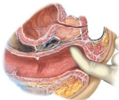
  

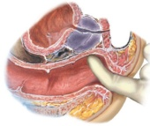
  

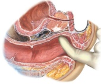
  

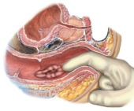

---

## The Musculoskeletal System  

## Fundamentals for Assessing Joints  

Musculoskeletal disorders (MSDs) are common and increasingly becoming an occupational health disorder. Indian studies have shown prevalence of around \(20\%\) in the community and up to \(90\%\) in specific population. This is much higher than the estimated global prevalence of \(14\%\) to \(42\%\) .  

Your first goal is to assess four key features of the patient's complaint. Is the joint problem:  

Articular or extra- articular; Axial or appendicular; Acute (usually \(< 6\) weeks) or chronic (usually \(>12\) weeks); Inflammatory or noninflammatory; and Monoarticular or oligoarticular or polyarticular Involving large joints or small joints? Symmetrical versus asymmetrical  

Differentiating arthralgia from arthritis is important. Arthralgia refers to the joint pain whereas arthritis means inflammation of the joint. Arthralgia may arise from the joint or the surrounding structures and it is subjective. Arthritis arises from the joint and is associated with physical findings (described later).  

Assessing joints requires knowledge of each joint's structure and function. Learn the surface landmarks and underlying anatomy of each of the major joints. Use the descriptive terms next.

---

## Joint Anatomy-Important Terms  

Joint Anatomy- Important Terms- Articular structures include the joint capsule and articular cartilage, the synovium and synovial fluid, intra- articular ligaments, and juxta- articular bone. Articular cartilage is composed of a collagen matrix containing charged ions and water, allowing the cartilage to change shape in response to pressure or load, acting as a cushion for underlying bone. Synovial fluid provides nutrition to the adjacent relatively avascular articular cartilage.- Extra- articular structures include periarticular ligaments, tendons, bursae, muscle, fascia, bone, nerve, and overlying skin.- Ligaments are rope- like bundles of collagen fibrils that connect bone to bone.- Tendons are collagen fibers connecting muscle to bone.- Bursae are pouches of synovial fluid that cushion the movement of tendons and muscles over bone or other joint structures.- Fascia is a subcutaneous structure made up of connective tissue (primarily collagen) that attaches and stabilizes muscles  

Age also provides clues to causes of joint pain.  

## Common Causes of Joint Pain by Age  

## Age \(< 60\) Years  

## Age \(>60\) Years  

Age \(< 60\) Years- Repetitive strain or overuse syndromes (tendinitis, bursitis)- Crystalline arthritis (gout; crystalline pyrophosphate deposition disease [CPPD])- Rheumatoid arthritis (RA), psoriatic arthritis and reactive (Reiter) arthritis (in inflammatory bowel disease [IBD])- Infectious arthritis from gonorrhea, Lyme disease, or viral infection (chikungunya, parvo virus, hepatitis B, etc.) or bacterial infection (brucellosis, tuberculosis, etc.)  

Osteoarthritis (OA) Osteoporotic fracture Gout and pseudogout  

Polymyalgia rheumatica (PMR)  

Review the three primary types of joint articulation—synovial, cartilaginous, and fibrous—and the varying degrees of movement each type allows. Note that joint anatomy determines its function and range of motion.  

## Types of Joints  

## Synovial Joints  

Synovial Joints- Freely movable within limits of surrounding ligaments- Separated by articular cartilage and a synovial cavity- Lubricated by synovial fluid- Surrounded by a joint capsule- Example: knee, shoulder  

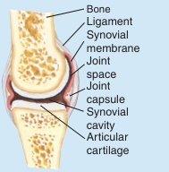

(continued) 

---

## Types of Joints (Continued)  

## Cartilaginous Joints  

Slightly movable Contain fibrocartilaginous discs that separate the bony surfaces Have a central nucleus pulposus of discs that cushions bony contact Example: vertebral bodies  

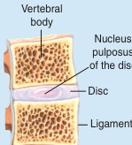
  

## Fibrous Joints  

Fibrous Joints- No appreciable movement- Consist of fibrous tissue or cartilage- Lack a joint cavity- Example: skull sutures  

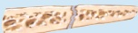
  

Review the types of synovial joints and their associated features as well.  

## Types of Synovial Joints  

## Spheroidal (ball and socket)  

Spheroidal (ball and socket)Articular shape: Convex surface in concave cavityMovement: Wide-ranging flexion, extension, abduction, adduction, rotation, circumductionExample: Shoulder, hip  

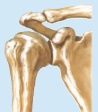
  

## Hinge  

HingeArticular shape: Flat, planarMovement: Motion in one plane; flexion, extensionExample: Interphalangeal joints of hand and foot; elbow  

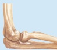
  

## Condylar  

CondylarArticular shape: Convex or concaveMovement: Movement of two articulating surfaces, not dissociableExample: Knee; temporomandibular joint  

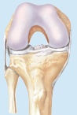

---

## The Health History  

## Common or Concerning Symptoms  

Common or Concerning Symptoms- Joint pain: articular or extra- articular, acute or chronic, inflammatory or noninflammatory, localized or diffuse- Joint pain: associated constitutional symptoms and systemic manifestations from other organ systems- Neck pain- Low back pain  

Assess the seven features of any joint pain (see p. 51).  

## Tips for Assessing Joint Pain  

Tips for Assessing Joint Pain- Ask the patient to "point to the pain." This may save considerable time because many patients have trouble pinpointing pain location in words.- Clarify and record when the pain started and the mechanism of injury, particularly if there is a history of trauma.- Determine whether the pain is articular or extra- articular, acute or chronic, inflammatory or noninflammatory, and localized (monoarticular) or diffuse (polyarticular).  

Some joint disorders have systemic manifestations in other organ systems that provide important clues to diagnosis. Ask about any family history of joint or muscle disorders. Watch for the symptoms, signs, and disorders below.  

## Systemic Disorders with Musculoskeletal Involvement  

<table><tr><td>Diseases</td><td>Clue to Diagnosis</td></tr><tr><td>Systemic lupus erythematosus</td><td>·Skin conditions ·Butterfly (malar) rash on the cheeks</td></tr><tr><td>Psoriatic arthritis</td><td>·Scaly plaques, especially on extensor surfaces, and pitted nails</td></tr><tr><td>Dermatomyositis</td><td>·Heliotrope rash on the upper eyelid</td></tr><tr><td>Gonococcal arthritis</td><td>·Papules, pustules, or vesicles with reddened bases on the distal extremities</td></tr></table>

---

# Systemic Disorders with Musculoskeletal Involvement (Continued)  

<table><tr><td>Diseases</td><td>Clue to Diagnosis</td></tr><tr><td>Lyme disease (erythema chronicum migrans)</td><td>·Expanding erythematous “tar-get” or “bull&#x27;s eye” patch early in an illness</td></tr><tr><td>Sarcoidosis, Behçet disease (erythema nodosum)</td><td>·Painful subcutaneous nodules especially in pretibial area</td></tr><tr><td>Vasculitis</td><td>·Palpable purpura</td></tr><tr><td>Serum sickness, drug reaction</td><td>·Hives</td></tr><tr><td>Reactive (Reiter) arthritis (with ure-thritis, uveitis)</td><td>·Erosions or scaling on the penis and crusted scaling pap-ules on the soles and palms</td></tr><tr><td>Arthritis of rubella</td><td>·The maculopapular rash of rubella</td></tr><tr><td>Dermatomyositis, systemic sclerosis</td><td>·Nailfold capillary changes</td></tr><tr><td>Hypertrophic osteoarthropathy</td><td>·Clubbing of the fingernails (see p. 228)</td></tr><tr><td>Reactive (Reiter) arthritis, Behçet syndrome, ankylosing spondylitis</td><td>·Red, burning, and itchy eyes (conjunctivitis), eye pain and blurred vision (uveitis)</td></tr><tr><td>RA, IBD, vasculitis</td><td>·Scleritis</td></tr><tr><td>Acute rheumatic fever or gonococcal arthritis</td><td>·Preceding sore throat</td></tr><tr><td>RA (usually painless); Behçet disease</td><td>·Oral ulcerations</td></tr><tr><td>RA; systemic sclerosis</td><td>·Pneumonitis; interstitial lung dis-ease</td></tr><tr><td>IBD, reactive arthritis from Salmo-nella, Shigella, Yersinia, Campylo-bacter; scleroderma</td><td>·Diarrhea, abdominal pain, cramp-ing</td></tr><tr><td>Reactive (Reiter) arthritis, gonococcal arthritis</td><td>·Urethritis</td></tr><tr><td>Lyme disease with central nervous system involvement</td><td>·Mental status change, facial or other weakness, stiff neck</td></tr></table>

IBD, Inflammatory bowel disease; RA, Rheumatoid arthritis.  

## Joint Pain  

## Articular or Extra-articular.  

Ask “Do you have any pains in your joints?” Ask the patient to point to the pain. If localized and involving only one joint, it is monoarticular.  

See Table 16- 1, Patterns of Pain in and Around the Joints, p. 324.  

Consider trauma, monoarticular arthritis, tendinitis, or bursitis. Hip pain near the greater trochanter suggests trochanteric bursitis.

---

If polyarticular, does it migrate from joint to joint, or steadily spread from one joint to multiple joint involvement? Is the involvement symmetric?  

If pain is extra- articular, are there generalized "aches and pains" (myalgia if in muscles, arthralgia if in joints with no evidence of arthritis)?  

Ask if there is decreased joint movement or stiffness.  

Acute or Chronic. Acute joint pain typically lasts up to 6 weeks; chronic pain lasts >12 weeks. Assess the timing, quality, and severity of joint symptoms.  

If from trauma, what was the mechanism of injury or series of events that caused the joint pain? Furthermore, what aggravates or relieves the pain? What are the effects of exercise, rest, and treatment?  

Inflammatory or Noninflammatory. Is the problem inflammatory or noninflammatory? Is there fever, chills, tenderness, warmth, or redness?  

Assess any stiffness or limitations of motion.  

Migratory pattern in rheumatic fever or gonococcal arthritis; progressive and symmetric pattern in rheumatoid arthritis  

Bursitis if inflammation of bursae; tendinitis if in tendons, and tenosynovitis if in tendon sheaths; also sprains from stretching or tearing of ligaments  

In articular pain, decreased active and passive range of motion and morning stiffness ("gelling"); in nonarticular joint pain, periarticular tenderness and only passive range of motion intact  

Severe pain of rapid onset in red swollen joint in acute septic arthritis or crystalline arthritis (gout; CPPD). In children, osteomyelitis in bone contiguous to a joint.  

See Table 16- 1, Patterns of Pain in and Around the Joints, p. 324.  

If inflammatory, consider infectious causes (Neisseria gonorrhoeae or Mycobacterium tuberculosis), crystal- induced (gout, pseudogout), immune- related (RA, SLE), reactive (rheumatic fever, reactive arthritis), or idiopathic arthritis. If noninflammatory, consider trauma (rotator cuff tear), repetitive use (bursitis, tendinitis), OA, fibromyalgia.  

Morning stiffness that gradually improves with activity in inflammatory disorders like RA and PMR; intermittent stiffness and gelling in OA

---

Localized or Diffuse. Ask the patient to point to the joints that are painful to determine if joint pain is be monoatricular, oligoarticular involving two to four joints, or polyarticular.  

Joint Pain: Associated Constitutional Symptoms and Systemic Manifestations from Other Organ Systems. Assess constitutional symptoms such as fever, chills, rash, fatigue, anorexia, weight loss, and weakness.  

Neck Pain. Ask about location, radiation into the shoulders or arms, arm or leg weakness, bladder or bowel dysfunction.  

If the patient reports neck trauma, common in motor vehicle accidents, ask about neck tenderness and consider clinical decision rules that identify risk of cervical cord injury (NEXUS criteria and Canadian C- Spine Rule).  

Low Back Pain. There are numerous clinical guidelines, but most categorize low back pain into three groups: nonspecific ( \(>90\%\) ), nerve root entrapment with radiculopathy or spinal stenosis ( \(- 5\%\) ), and pain from a specific underlying disease ( \(1\%\) to \(2\%\) ). Ask, "Do you have any pains in your back?" and "Is the pain in the midline over the vertebrae, or off midline?"  

If the pain radiates into the legs, ask about any associated numbness, tingling, or weakness. Ask about history of trauma.  

Monoarticular arthritis in traumatic, crystalline, or septic arthritis; oligoarticular arthritis gonorrhea or rheumatic fever, connective tissue disease, and OA; polyarthritis if may be viral or inflammatory from RA, SLE, or psoriasis  

Common in RA, SLE, PMR, and other inflammatory arthritis. High fever and chills suggest an infectious cause.  

C7 or C6 spinal nerve compression from foraminal impingement more common than disc herniation. See Table 16- 2, Pains in the Neck, p. 325.  

See Table 16- 3, Low Back Pain, pp. 326- 327. Midline back pain in vertebral collapse, disc herniation, epidural abscess, spinal cord compression, or spinal cord metastases. Pain off the midline in muscle strain, sacroiliitis, trochanteric bursitis, sciatica, hip arthritis, renal conditions such as pyelonephritis or renal stones  

Sciatica if radicular gluteal and posterior leg pain in the S1 distribution that increases with cough or Valsalva

---

Check for bladder or bowel dysfunction.  

Elicit any "red flags" for serious underlying systemic disease.  

Present in cauda equina syndrome from S2- 54 tumor or disc herniation, especially if "saddle anesthesia" from perianal numbness  

## Red Flag Signs for Low Back Pain to Look for Underlying Etiology  

Red Flag Signs for Low Back Pain to Look for Underlying Etiology- Age \(< 20\) years or \(>50\) years- History of cancer- Unexplained weight loss, fever, or decline in general health- Pain lasting more than 1 month or not responding to treatment- Pain at night or present at rest- History of intravenous drug use, addiction, or immunosuppression- Increased risk of atypical spinal infections like tuberculosis, fungal, and brucellosis. Besides presentation is often late and only related with pain- Presence of active infection or human immunodeficiency virus (HIV) infection- Long-term steroid therapy- Saddle anesthesia, bladder or bowel incontinence- Neurologic symptoms or progressive neurologic deficit  

## Health Promotion and Counseling: Evidence and Recommendations  

## Important Topics for Health Promotion and Counseling  

Nutrition, Weight, and Physical Activity. Good nutrition supplies the calcium and vitamin D needed for bone mineralization and bone density, with supplements advised in selected age groups. Optimal weight reduces excess mechanical stress on weight- bearing joints like the hips and knees. Exercise helps maintain bone mass and improves outlook and stress management.  

Nutrition, Weight, and Physical Activity. Good nutrition supplies the calcium and vitamin D needed for bone mineralization and bone density, with supplements advised in selected age groups.Optimal weight reduces excess mechanical stress on weight- bearing joints like the hips and knees. Exercise helps maintain bone mass and improves outlook and stress management.

---

## Physical Activity Guidelines as Recommended by WHO  

An average adult should perform at least 2 hours and 30 minutes or 150 minutes of exercise per week if indulging in moderate- intensity activity or at least 75 minutes if performing vigorous- intensity aerobic physical activity. Doubling the duration of the exercise of moderate or severe intensity, i.e. 300 or 150 minutes respectively, will lead to improved health benefits. These aerobic exercises should be performed at bursts of at least 10 minutes each session and should be intermixed with muscle- strengthening ("anaerobic") exercises on 2 or more days a week. However, the predisposition of Indians for diabetes and coronary heart disease means that as much as 60 minutes per day of physical activity is recommended for healthy Asian Indians. The suggested 60 minutes include 30 minutes of moderate- intensity aerobic activity, and 15 minutes each of work- related activity and muscle- strengthening exercises. For children and adolescents, this activity is best prescribed at 60 minutes per day of sports with moderate- intensity physical activity.  

Low Back Pain. Most patients with acute low back pain get better within 6 weeks; for patients with nonspecific symptoms, clinical guidelines emphasize reassurance, staying active, analgesics, muscle relaxants, and spinal manipulation therapy. About \(10\%\) to \(15\%\) of these patients develop chronic symptoms, often associated with long- term disability. Poor outcomes are linked to inappropriate pain- coping behaviors (avoiding work, movement, or other activities for fear of causing back damage), multiple nonorganic physical examination findings, psychiatric disorders, poor general health, high levels of baseline functional impairment, and low work satisfaction.  

Osteoporosis: Risk Factors, Screening, and Assessing Fracture Risk. Osteoporosis is a major public health threat and the prevalence of osteoporosis among Indian men and women above 50 years is about \(25\%\) and \(43\%\) , respectively. In Indian population, osteoporosis and osteopenia can be seen at a relatively younger age.  

The U.S. Preventive Services Task Force (USPSTF) gives a grade B recommendation supporting osteoporosis screening for women age ≥65 years and for younger women whose 10- year fracture risk equals or exceeds that of an average- risk 65- year- old white woman.

---

## Risk Factors for Osteoporosis  

Postmenopausal status in women Age \(\geq 50\) years Prior fragility fracture Low body mass index Low dietary calcium Vitamin D deficiency Tobacco and excessive alcohol use Family history of fracture in a firstdegree relative, particularly with history of fragility fracture  

- Clinical conditions such as thyrotoxicosis, celiac sprue, IBD, cirrhosis, chronic renal disease, organ transplantation, diabetes, HIV, hypogonadism, multiple myeloma, anorexia nervosa, and rheumatologic and autoimmune disorders- Medications such as oral and high-dose inhaled corticosteroids, anticoagulants (long-term use), aromatase inhibitors for breast cancer, methotrexate, selected antiseizure medications, immunosuppressive agents, proton-pump inhibitors (long-term use), and antigonadal therapy for prostate cancer  

Use the country-specific FRAX calculator to assess fracture risk. If risk is \(>9.3\%\) for any fracture and \(>3\%\) for hip fracture, bone density screening is warranted. The website for the FRAX Calculator for Assessing Fracture Risk for the United States is http://www.shef.ac.uk/FRAX/tool.jsp?country=9.  

Use the World Health Organization scoring criteria to determine bone density.  

## World Health Organization Bone Density Criteria  

Osteoporosis: T score \(< - 2.5\) ( \(>2.5\) standard deviations below the mean for young adult white women) Osteopenia: T score between \(- 1.0\) and \(- 2.5\) ( \(1.0\) to \(2.5\) SDs below the young adult mean)  

Treating Osteoporosis and Preventing Falls. Learn the therapeutic uses of agents that inhibit bone resorption: calcium and vitamin D; antiresorptive agents such as bisphosphonates, selective estrogen-receptor modulators (SERMs), calcitonin, and postmenopausal estrogen; and anabolic agents such as PTH.  

More than one in three adults over age 65 years falls each year. Risk factors for falls include increasing age, impaired gait and balance, postural

---

hypotension, loss of strength, medication use, comorbid illness, depression, cognitive impairment, and visual deficits.  

The USPSTF gives a grade B recommendation for providing exercise or physical therapy and/or vitamin D supplementation to prevent falls among at- risk community- dwelling adults age ≥65 years. Effective exercise interventions target balance, gait, and strength training. Urge patients to correct poor lighting, dark or steep stairs, chairs at awkward heights, slippery or irregular surfaces, and ill- fitting shoes. Scrutinize any medications affecting balance, especially benzodiazepines, vasodilators, and diuretics.  

## Techniques of Examination  

## Steps for Examining the Joints  

Steps for Examining the Joints1. Inspect for joint symmetry, alignment, bony deformities, and swelling2. Inspect and palpate surrounding tissues for skin changes, nodules, muscle atrophy, tenderness3. Assess range of motion and maneuvers to test joint function and stability and the integrity of ligaments, tendons, bursae, especially if pain or trauma4. Assess any areas of inflammation, especially tenderness, swelling, warmth, redness  

Inspect and palpate any joints with signs of inflammation.  

## The Four Signs of Inflammation  

Note: The normal site should preferably be inspected first followed by abnormal site.  

Swelling. Palpable swelling may involve: (1) the synovial membrane, which can feel boggy or doughy; (2) effusion from excess synovial fluid within the joint space; or (3) soft tissue structures, such as bursae, tendons, and tendon sheaths. Warmth. Use the backs of your fingers to compare the involved joint with its unaffected contralateral joint, or with nearby tissues if both joints are involved. Redness. Redness of the overlying skin is the least common sign of inflammation near the joints and is usually seen in more superficial joints like fingers, toes, and knees. Pain or tenderness. Try to identify the specific anatomic structure that is tender.

---

## Temporomandibular Joint  

Inspect the temporomandibular joint (TMJ) for swelling or redness.  

Palpate the TMJ as the patient opens and closes the mouth (Fig. 16- 1).  

Palpate the muscles of mastication: the masseters, temporal muscles, and pterygoid muscles.  

## Shoulders  

Inspect the contour of the shoulders and shoulder girdles from front and back.  

Palpate:  

The clavicle from the sternoclavicular joint to the acromioclavicular joint (Fig. 16- 2)  

The bicipital tendon  

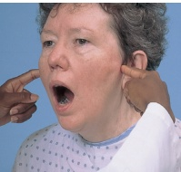

Figure 16-1 Palpate the TMJ. 
  

Muscle atrophy; anterior or posterior dislocation of humeral head; scoliosis if shoulder heights asymmetric  

See Table 16- 4, Painful Shoulders, p. 328.  

"Step- offs" if fracture from trauma  

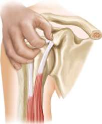

Figure 16-2 Palpate the bicipital groove and tendon. 

---

## EXAMINATION TECHNIQUES  

The subacromial and subdeltoid bursae after lifting arm posteriorly (Fig. 16- 3)  

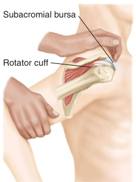

Figure 16-3 Palpate the subacromial bursa. 
  

Assess range of motion.  

Flexion- "Raise your arm in front of you and overhead."  

Extension- "Move your arms behind you."  

Abduction- "Raise your arms out to the side and overhead."  

Adduction- "Cross your arm in front of your body, keeping the arm straight."  

## POSSIBLE FINDINGS  

Subacromial or subdeltoid bursitis; tenderness over the SITS (Supraspinatus, Infraspinatus, Teres minor, and Subscapularis) muscle insertions and difficulty abducting the arm above shoulder level occurs in sprains, tears, tendon rupture of rotator cuff.  

Intact glenohumeral motion if patient raises arms to shoulder level, palms facing down  

Intact scapulothoracic motion if patient raises arms an additional 60 degrees, palms facing up  

Acromioclavicular joint arthritis

---

## EXAMINATION TECHNIQUES  

External and internal rotation (Figs. 16- 4 and 16- 5)  

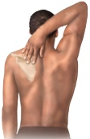

Figure 16-4 Test abduction and external rotation. 
  

Perform five maneuvers to assess the "SITS" muscles of the rotator cuff and the bicipital tendon.  

## POSSIBLE FINDINGS  

## Shoulder arthritis  

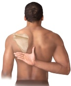

Figure 16-5 Test adduction and internal rotation. 
  

Pain or inability to perform these maneuvers in rotator cuff sprains, tendinitis, rupture  

## Five Maneuvers for SITS Muscle Assessment  

## Pain Provocation Test  

Painful arc test (Fig. 16- 6). Fully abduct the patient's arm from o to 180 degrees.  

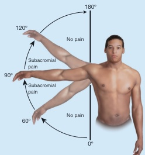

Figure 16-6 Painful arc test. 
  

(continued)

---

## Five Maneuvers for SITS Muscle Assessment (Continued)  

## Strength Tests  

External rotation lag test (Fig. 16- 7). With the patient's arm flexed to 90 degrees with palm up, rotate the arm into full external rotation.  

Internal rotation lag test (Fig. 16- 8). Ask the patient to place the dorsum of the hand on the low back with the elbow flexed to 90 degrees. Then you lift the hand off the back, which further internally rotates the shoulder. Ask the patient to keep the hand in this position.  

Drop- arm test (Fig. 16- 9). Ask the patient to fully abduct the arm to shoulder level, up to 90 degrees, and lower it slowly. Note that abduction above shoulder level, from 90 to 120 degrees, reflects action of the deltoid muscle.  

## Composite Test  

External rotation resistance test (Fig. 16- 10). Ask the patient to adduct and flex the arm to 90 degrees, with the thumbs turned up. Stabilize the elbow with one hand and apply pressure proximal to the patient's wrist as the patient presses the wrist outward in external rotation.  

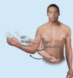

Figure 16-7 Internal rotation lag test. 
  

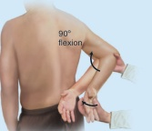

Figure 16-8 External rotation lag test. 
  

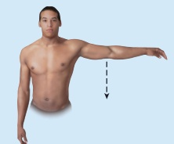

Figure 16-9 Drop arm test. 
  

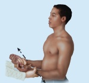

Figure 16-10 External rotation resistance test. 
